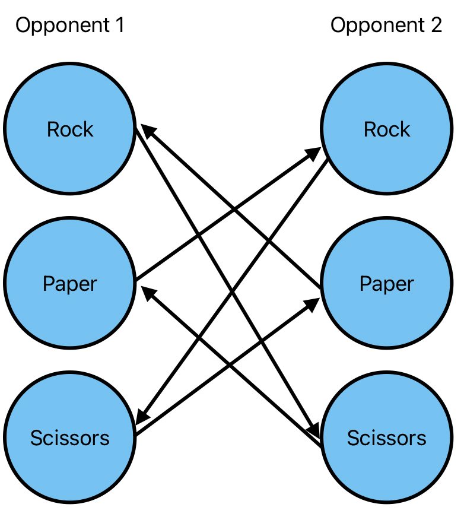
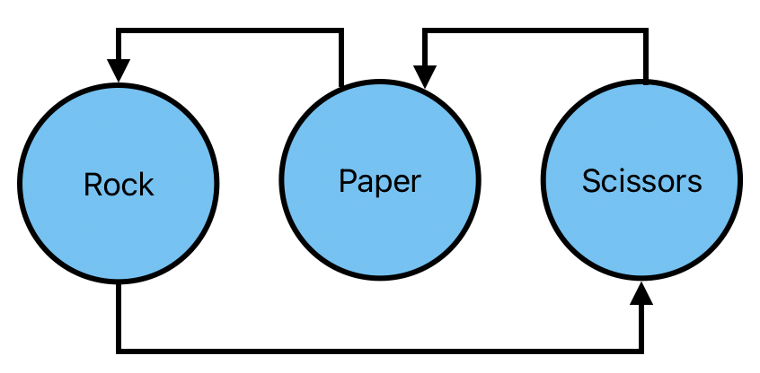
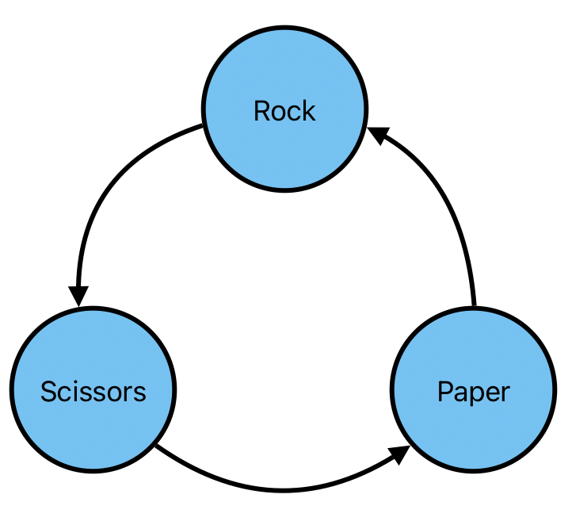

There are two types of circular lists;

* Circular singly linked list: Each node contains a pointer to the next node, and the last node contains a pointer to the first. We need to traverse the list until we reach the node we started at. 

* Circular doubly linked list: Behaves like a singly linked list, however nodes contain a pointer to the next node, and the previous node, allowing us to traverse bi-directionally. The last node contains a pointer to the first node, and vice versa. 

Why is this useful? 

Let's look at the game rock, paper, scissors. The outcome is circular, meaning that each move is weak to the move that follows it.

- Rock is weak to paper
- Paper is weak to Scissors
- Scissors is weak to rock

So we could write the following indefinitely;

```
S -cuts-> P -covers-> R -smashes-> S -cuts-> P -covers-> R -smashes-> S -cuts-> P ... and so on.
```

However, visualisation of the problem is important. Consider the following grid of possible outcomes;



This is a lot of information for such a simple game, but it is a good step, because we can clearly see a line of reflection down the middle, and to me, while tackling this problem, it meant that "something" was there. 

So, simplifying, we can remove the second opponent and work with a single set of moves;



We start to see the circular nature of this game's moveset, so it's make one final adjustment;



Because we've reduce this down to such a simple form, coding a game of rock, paper, scissors becomes somewhat trivial with a circular list. In Go, we can use the `container/ring` package and define it with 3 integers;

```go
    // 1 - Rock
    // 2 - Paper
    // 3 - Scissors
	r := ring.New(3)
	for i := 0; i < 3; i++ {
		r.Value = i + 1
		r = r.Next()
	}
```

Here, if I play `Rock (1)`, then I can judge the outcome based on whether the opponent's move is the previous, next, or same value as mine, because each move is strong to the previous move, and weak to next in the list;

```go
    opponentMove := 2 // Paper
    yourMove := 1 // Rock

    // Place ring at opponents move if not already
    if r.Prev().Value.(int) == opponentMove {
        r = r.Prev()
    } else if r.Next().Value.(int) == opponentMove {
        r = r.Next()
    }

    outcome := ""
    if yourMove == r.Value {
        // Draw
    } else if you == r.Prev().Value.(int) {
        // Lose
    } else if you == r.Next().Value.(int) {
        // Win
    }
```

Circular lists can help make certain scenarios trivial, provided that you visualise the problem as such. 


